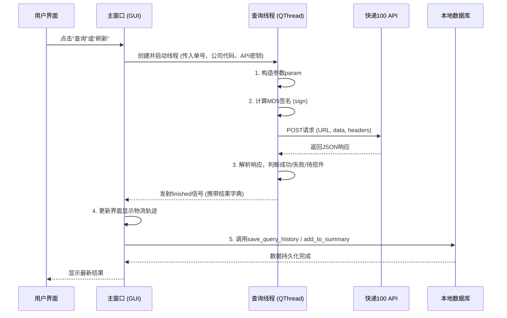

# 软件截图 v1.1.32


***

---

# 快递查询系统 (Express Query) - 完全使用指南与开发手册

<div align="center">

**版本：** v1.1.34 | **构建日期：** 2026-04-12 | **作者：** 杜玛

**[ 从零基础到高级应用完全指南 ]**

</div>

---

## 前言：这是一款怎样的软件？

简单来说，这是一款**专为个人和中小企业设计的、开源的、支持多账号管理的快递批量查询与跟踪系统**。

想象一下这些场景：
- **网购达人**：你同时买了十几件商品，分布在淘宝、京东、拼多多，想在一个地方看到所有包裹到哪儿了，而不是一个个打开APP。
- **微商/小店店主**：你每天要发几十个快递，需要给客户发送单号，还要知道哪些已经签收，哪些还在路上，甚至要给包裹添加备注（比如“客户订的红色毛衣”）。
- **公司行政/财务**：你需要跟踪重要文件（合同、发票）的寄送状态，并保留截图作为凭证。
- **技术爱好者**：你想了解快递API如何工作，数据如何存储，甚至想自己修改或扩展这个软件的功能。

这个软件就是为了解决这些需求而生的。它不是一个简单的网页版查询工具，而是一个**本地化的、多用户的、功能强大的桌面应用程序**。

---

## 第一部分：新手入门 (5分钟快速上手)

> **目标人群**：完全没有编程或数据库概念的用户。只需要“能用起来”。

### 1.1 安装与启动 (以Windows为例)

1.  **下载**：从 [GitHub发布页](https://github.com/duma520/Express_Query/releases) 下载最新的 `Express_Query.exe` 文件。
2.  **运行**：双击 `Express_Query.exe`。软件会**在它所在的目录下自动创建一个 `data` 文件夹**，用来存放所有数据。
3.  **首次启动**：你会看到一个 **“选择用户”** 的窗口。
    - **操作**：直接双击 **“默认用户”** 即可登录。你也可以点击“添加用户”创建自己的名字。

### 1.2 第一次查询快递 (图解)

登录后，你会看到一个色彩柔和的“马卡龙”风格界面。我们以查询一个虚构的快递单号 `SF1234567890` 为例：

**步骤1：进入“快递查询”标签页**
- 点击顶部标签栏的 **“🔍 快递查询”**。

**步骤2：输入信息**
- **快递单号**：输入 `SF1234567890`。
- **快递公司**：选择 **“顺丰速运”**。 (如果你不确定，可以选“自动识别”，软件会尝试判断)。

**步骤3：开始查询**
- 点击 **“🔍 开始查询”** 按钮。

**结果解读：**
- 如果单号有效，下方会显示 **“基本信息”**（快递公司、状态）、**“物流轨迹”**（详细的时间线）和 **“原始数据”**。
- 系统会自动弹出一个对话框，询问你是否要“添加到汇总”。点击 **“是”**。

**恭喜！** 你已经完成了第一次查询。这个快递单号已经被保存到系统的“心脏”里了。

### 1.3 核心功能：“快递汇总” - 你的私人物流管家

点击 **“📦 快递汇总”** 标签，这是你所有包裹的“作战指挥中心”。

- **智能分类**：系统会根据物流信息，自动将你的包裹分类到不同的颜色块中。
    - ✅ **已签收** (绿色)：包裹已收到。
    - 📍 **已到驿站** (橙色)：快去取件！
    - 🚚 **派件中** (蓝色)：快递小哥正在路上。
    - ✈️ **在途中** (紫色)：正常运输中。
    - ⚠️ **疑难件** (红色)：可能地址有误或联系不上，需要你关注。
- **查看详情**：点击任何一个包裹卡片上的 **“最新: ...”** 文字，可以查看完整的物流轨迹。
- **添加备注**：点击 **“点击添加备注...”**，你可以写上“生日礼物”、“给老板的合同”等，方便记忆。
- **添加截图**：点击包裹卡片左侧的 **“添加截图”** 区域，可以上传或粘贴截图（如订单详情、聊天记录），作为凭证。
- **手动刷新**：点击 **“刷新”** 按钮，可以立即从快递100 API获取该包裹的最新状态。
- **批量操作**：
    - 点击分类右侧的 **“刷新此类”**，可以刷新该分类下所有包裹。
    - 点击顶部的 **“🔄 刷新全部”**，可以刷新你添加的所有包裹。
    - 点击 **“📤 导出汇总”**，可以将所有包裹信息导出为一个CSV文件，可以用Excel打开，方便做报表。

---

## 第二部分：进阶应用 (成为效率专家)

> **目标人群**：有一定电脑使用经验，希望发挥软件全部威力的用户。

### 2.1 API账号管理：解决免费额度限制

快递100 API每天有免费查询次数限制（通常100次/天）。如果你包裹很多，一个账号不够用。这个软件支持多账号轮询。

**场景举例**：你每天要查200个包裹。你可以申请两个快递100的账号，每个都有100次/天的额度。

**操作步骤：**
1.  点击工具栏的 **“⚙️ 设置”** -> **“管理API账号”**。
2.  点击 **“添加账号”**，输入一个易记的“账号名称”（如“主账号”），并填写你在快递100官网申请的 `Customer` 和 `Auth Key`。
3.  重复步骤2，添加第二个账号（如“备用账号”）。
4.  **关键一步**：勾选 **“启用额度用完自动切换账号”**。
5.  点击 **“保存设置”**。

**工作原理**：当你查询第101个快递时，系统会检测到“主账号”额度已用完，它会自动、无缝地切换到“备用账号”继续查询。对你来说，这一切都是透明的。

**小贴士**：
- 你可以在账号管理界面调整账号顺序（上移/下移），排在最上面的就是默认账号。
- **“导出/导入账号”** 功能：如果你有多台电脑，可以用这个功能把账号配置备份出来，恢复到另一台电脑上，不用重复输入。

### 2.2 送达时间预估：基于你的历史数据

这个功能非常智能。它不仅看快递公司的平均速度，还会**学习你的个人收货习惯**。

**场景举例**：
你住在北京，经常从广州的卖家那里买东西。第一次，圆通用了3天。第二次，用了4天。系统会自动记录这些数据。

当你第三次购买时，在“快递汇总”卡片上，你会看到一行小字：**“预计04月18日送达 (基于2条签收历史记录，平均3.5天送达)”**。

**专业说明**：系统只记录 **“已签收”** 和 **“已到驿站”** 的完整时效数据。它计算的是从 **“揽收”** 到 **“签收/到站”** 的自然天数。数据越多，预估越准。

### 2.3 数据安全与备份：永远不丢失

你的所有查询历史、备注、截图都存储在本地数据库中。万一电脑坏了怎么办？

- **自动备份**：系统默认**每小时**自动在 `data/backups` 文件夹下创建一个备份。
- **手动备份**：点击 **“🗄️ 数据库管理”** -> **“💾 备份管理”**。
    - **立即备份**：手动创建一个备份点。
    - **恢复备份**：如果数据乱了或丢失了，可以在这里选择一个历史备份文件，一键恢复。
    - **设置**：可以调整保留多少个备份（默认30个），旧的会自动删除。

---

## 第三部分：专业开发者手册 (深度解析)

> **目标人群**：开发者、技术爱好者、希望二次开发或部署的用户。

### 3.1 技术架构概览

- **前端/UI框架**：`PySide6` (Qt for Python) – 提供跨平台的原生桌面应用体验。
- **后端逻辑**：`Python 3` – 胶水语言，负责API调用、数据处理、界面逻辑。
- **数据存储**：`SQLite` – 轻量级、无服务器的嵌入式数据库，每个用户一个独立文件。
- **网络请求**：`Requests` – 处理与快递100 API的HTTP通信。
- **并发模型**：`QThread` – 所有网络查询均在后台线程执行，避免界面卡顿。

### 3.2 核心代码解析与流程图

#### 快递查询核心流程 (ExpressQueryThreadPro)



#### 智能状态分类逻辑 (get_state_category)

这是将原始API状态码（0,1,2,3...）和文本描述（“已签收”、“到达【菜鸟驿站】”）映射到用户友好分类（“✅已签收”、“📍已到驿站”）的核心函数。代码采用了**优先级判断**策略：

1.  **最高优先级：已签收** (判断 `state == '3'` 或文本含‘签收’)。
2.  **次高优先级：已到驿站** (判断文本含‘驿站’、‘菜鸟’、‘丰巢’等关键词)。
3.  **第三优先级：派件中** (判断 `state in ['5','15',...]` 或文本含‘派件’)。
4.  **最后兜底：在途中** (如果都不匹配，默认归为在途中)。

### 3.3 数据库设计 (ER图核心)

每个用户一个数据库文件 (`user_<用户名>.db`)，包含以下核心表：

-   **express_summary** (快递汇总表)
    -   字段：`id`, `tracking_number`(单号), `company_name`, `status`(状态文本), `status_category`(分类key), `remark`(备注), `screenshot`(base64图片), `result_data`(完整API返回JSON)...
    -   用途：为“快递汇总”标签页提供数据。

-   **express_query_history** (查询历史表)
    -   字段：`query_time`, `tracking_number`, `status`, `quota_remaining`...
    -   用途：记录每一次API查询，用于“查询历史”标签页。

-   **api_accounts** (API账号表)
    -   字段：`account_name`, `customer`, `auth_key`, `daily_limit`, `used_today`, `sort_order`...
    -   用途：实现多账号管理和自动切换。

-   **delivery_history** (时效历史表)
    -   字段：`tracking_number`, `company_code`, `origin_city`, `dest_city`, `delivery_days`...
    -   用途：为“送达时间预估”提供历史数据支持。

### 3.4 二次开发指南 (如何修改)

1.  **环境搭建**：
    ```bash
    git clone https://github.com/duma520/Express_Query.git
    cd Express_Query
    pip install -r requirements.txt
    ```
    *(注：`requirements.txt` 需包含 `PySide6`, `requests`)*

2.  **修改样式**：所有颜色和样式定义在 `MacaronColors` 和 `MacaronStyle` 类中。你可以轻松修改色值来定制自己的主题。
    -   **举例**：将全局主色调从 `BLUE_SKY` 改为 `GREEN_MINT`，只需修改 `MacaronStyle.get_main_style` 中的相关颜色引用。

3.  **添加新的快递公司**：
    -   在 `ExpressQueryProGUI.__init__` 中找到 `self.company_codes` 字典，按照 `"显示名称": "快递100代码"` 的格式添加新条目。
    -   快递公司代码请查阅 [快递100官方文档](https://www.kuaidi100.com/download/api_kuaidi100_com.html)。

4.  **打包成独立EXE**：
    -   项目使用了 `PyInstaller`。你可以使用以下命令打包：
    ```bash
    pyinstaller --onefile --windowed --name "Express_Query" --icon=icon.ico Express_Query.py
    ```

---

## 第四部分：常见问题 (疑难解答)

**Q1: 为什么查询时提示“未配置API账号”？**
**A:** 本软件不自带快递查询接口，需要你自行去 [快递100](https://www.kuaidi100.com/) 注册账号，获取 `Customer` 和 `Auth Key`。这是免费的。然后在软件的“设置” -> “管理API账号”中添加。

**Q2: 为什么单号显示“待揽件”？**
**A:** 这通常是正常的。说明快递单号已经录入快递公司系统，但快递员还没有上门取件。等包裹被揽收后，物流信息会自动更新。此时你点击“刷新”就能看到新状态。

**Q3: 软件会占用很多内存吗？**
**A:** 不会。SQLite数据库非常轻量级。即使管理上千个快递，内存占用通常也在200MB以下。软件使用了 `PRAGMA journal_mode=WAL` 和缓存优化，保证了性能。

**Q4: 截图保存在哪里？**
**A:** 截图以 **Base64编码的字符串** 形式直接存储在 `express_summary` 表的 `screenshot` 字段中，不单独生成图片文件。这方便了数据库的备份和迁移，但会使数据库文件体积增大。一张截图约增加100-300KB。

**Q5: 我换了一台电脑，如何迁移数据？**
**A:** 非常简单。将整个程序目录（包括 `data` 文件夹和 `Express_Query.exe`）复制到新电脑上即可。所有用户、配置、快递数据都在 `data` 文件夹里。

---

## 第五部分：版本更新历史

> **从 v1.1.32 到 v1.1.34**

### v1.1.34 (2026-04-12) - 当前版本
**核心更新：**
1.  **✨ 送达时间预估功能增强**：现在不仅基于历史签收数据，还会记录并利用“到达驿站”的时效数据进行预估，更贴近实际取件时间。
2.  **✨ 导入/导出功能完善**：API账号管理对话框新增“导出账号”和“导入账号”按钮。导出时可选择“包含完整密钥”用于备份，或“隐藏密钥”用于安全分享。
3.  **🐛 修复**：修正了某些情况下“待揽件”状态被误判为“查询失败”的问题。现在单号有效但无轨迹时会正确显示为“待揽件”。
4.  **🐛 修复**：解决了批量刷新时时效数据重复记录的问题。
5.  **💄 界面优化**：进一步优化了马卡龙配色在对话框和菜单中的显示效果。

### v1.1.33 (内部版本)
-   **🐛 修复**：修复了备份恢复后需要手动重启才能生效的问题，现在恢复后会自动重新加载数据库。
-   **🐛 修复**：修复了历史记录搜索时“剩余配额”列无法被搜索到的问题。
-   **💄 界面优化**：数据库管理标签页中的表格现在设置为只读模式，防止意外编辑。

### v1.1.32 (基础版本)
-   **🎉 首次发布**：实现多用户支持。
-   **🎨 全新UI**：采用“马卡龙”色系，去除了所有圆角，保持控件原生大小，界面清爽专业。
-   **🚀 核心功能**：快递查询、自动分类汇总、多API账号轮询、截图与备注、数据库备份与恢复。
-   **⏱️ 智能功能**：基于历史数据的送达时间预估。

---

## 版权与支持信息

-   **作者**：杜玛
-   **版权**：© 永久 杜玛 保留所有权利
-   **开源许可证**：**GNU Affero General Public License v3.0**
    -   这意味着你可以免费使用、学习、修改和分发本软件。但如果你修改了代码并部署为网络服务，你必须公开你的源代码。
-   **项目地址**：[https://github.com/duma520/Express_Query](https://github.com/duma520/Express_Query)
-   **问题报告**：请通过 GitHub Issues 提交。**我们不提供私人邮箱支持**，这可以确保问题和解决方案对所有用户公开，帮助到更多人。
-   **版权声明**：本文档内容未经作者书面许可，不得转载或用于任何商业用途。

---
**感谢您使用快递查询系统！希望这份指南能帮助您从新手成长为专家。**
